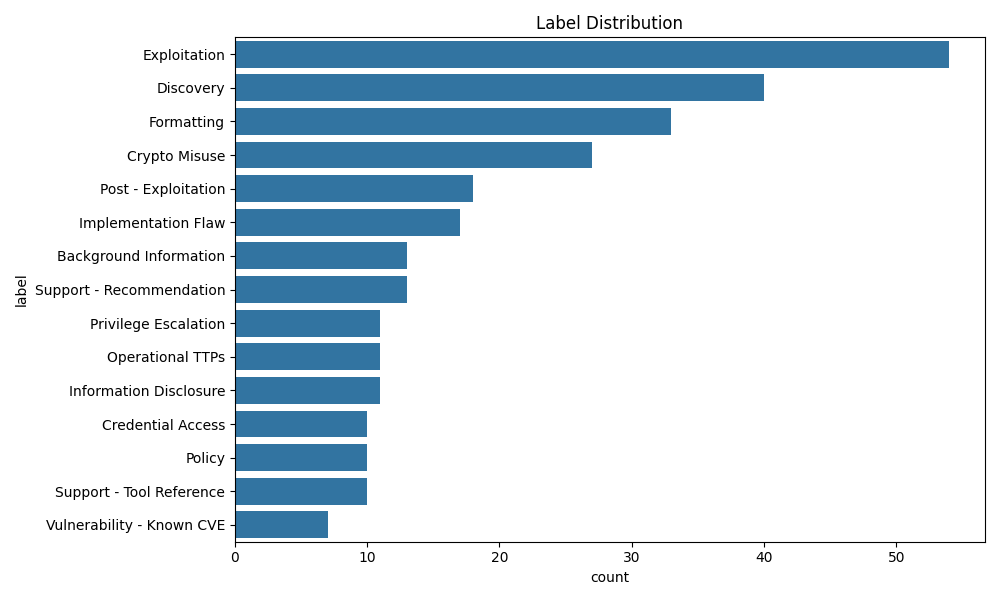

# Cybersecurity RAG Assistant

The goal is to create a cybersecurity tool that users can use to ask any range of cybersecurity questions from offensive to defensive by combining semantic search, large language models, and expert-curated datasets (MITRE CWE + DISA STIGs).

Built from using scraped PDF reports of penetration test reports, custom labeling, natural language processing, and modern RAG techniques, and the reality of working with unstructured cybersecurity data.

---

## Overview

This project allows users to ask cybersecurity questions in natural language and receive human-like responses based on structured data from trusted sources. It does this entirely offline using:

- A FAISS vector store over MITRE CWE and DISA STIG content
- Sentence embeddings from `all-mpnet-base-v2`. Chosen for its reasonable size, works on limited hardware, semantic speciality, and proficient retrieval and ranking tasks.
- A locally hosted LLM (`mistral-7b-instruct`) served via LM Studio
- A command-line querying interface for security researchers and analysts

The goal is to reduce noise, increase technical relevance, and answer questions with documentation-based context — without ever needing to query an external API.

---

## Usage

```
# To query FAISS
python scripts/query/query_faiss_index.py

# To query with LM Studio 
# (Requires instance of local model running, reachable at http://127.0.0.1:1234)
python .\scripts\query\query_with_lm_studio.py
```


---

## System Flow

```
User Prompt
   ↓
Embed Query (mpnet-v2)
   ↓
FAISS Search (Top-K)
   ↓
RAG Assembly (context injection, truncation)
   ↓
Mistral-7B via LM Studio (OpenAI endpoint)
   ↓
Response
```

---

## RAG Dataset Source: MITRE Top 25 + STIGs

After testing HackerOne, Kaggle, and other datasets, the MITRE CWE Top 25 and DISA STIG datasets were selected due to:

- Strong internal structure (IDs, descriptions, mitigations, examples)
- Rich cybersecurity-specific language
- CSV and JSON formats suitable for processing

Each record was cleaned, normalized, and converted to `.jsonl` to support chunked semantic search.

---

## Key Features

- Local-only inference (zero API keys, zero vendor lock-in)
- Fast similarity search with FAISS
- Real-time prompt assembly for 7B models (truncation-safe)
- Designed for cybersecurity, not general NLP
- Regex-based cleaning of messy markdown from source datasets

---

## Technologies

- Python 3.11
- FAISS
- SentenceTransformers (`all-mpnet-base-v2`)
- LM Studio
- Mistral-7B-Instruct (local model)
- Custom CLI + `.jsonl` format for clean RAG inputs

---

## File Structure

```plaintext
pentest_nlp_project/
├── README.md
├── requirements.txt
├── explore_data.py
├── data/

│   ├── cyber_threats/
│   │   ├── mitre_cwe_clean.csv
│   ├── embeddings/
│   │   ├── combined_cybersecurity_knowledge_base.jsonl
│   │   ├── combined_faiss.index
│   │   ├── combined_metadata.csv / .pkl
│   │   ├── mitre_cwe_knowledge_base.jsonl
│   │   ├── mitre_faiss.index
│   │   ├── stig_faiss.index
│   │   ├── stig_metadata.csv
│   │   ├── stig_traditional_security_checklist_v2r6.jsonl
│   ├── processed/
│   │   ├── Final_Labels_Dataset.csv
│   │   ├── Cleaned_Labels_Dataset.csv
│   │   ├── train.csv / test.csv
│   │   ├── X_train.pkl / X_test.pkl
│   │   ├── y_train.pkl / y_test.pkl
│   │   ├── X_test_texts.pkl
│   ├── raw/
│   │   ├── *.pdf
│   │   ├── *.txt
│   ├── STIGs/
│   │   ├── stig_traditional_security_checklist_v2r6_flat.csv

├── models/
│   ├── LinearSVC_model.pkl
│   ├── logistic_model.pkl
│   ├── tfidf_vectorizer.pkl
│   ├── label_map.json

├── scripts/
│   ├── csv_to_rag_jsonl.py
│   ├── embed_and_index.py
│   ├── prepare_data.py
│   ├── suggest_labels.py
│   ├── train_baseline_model.py
│   ├── vectorize_data.py
│   ├── predict.py

│   ├── defensive/
│   │   ├── fetch_stig_detailed_csv.py

│   ├── ingest/
│   │   ├── convert_csv_to_jsonl.py
│   │   ├── ingest_combined_jsonl_to_faiss.py

│   ├── query/
│   │   ├── query_faiss_index.py
│   │   ├── query_with_lm_studio.py

│   ├── utils/
│   │   ├── convert_pkl_to_csv.py
│   │   ├── warmup_imports.py

├── notebooks/
└── outputs/

```

---

## Future Work

- Support adding more data from STIGs and MITRE
- Reinstate attack phase labeling from legacy classifier
- Integrate more offensive security, find data sets that would match the criteria
- Introduce more "memory"
- Improve or find an adequate report parser to be to pull data at large scale.

---

# Pentest Report Classifier (Legacy Prototype)

An earlier version of this project focused on **classifying paragraphs from penetration test reports** into attack phases like `Discovery`, `Exploitation`, or `Persistence`.

Despite low accuracy (~58%) and poor data quality, the pipeline revealed useful lessons and may be re-integrated as a tagging mechanism in future iterations of the RAG system.

---

## Goal

- Phase 1: Build a supervised classifier to learn attack tactics from labeled real-world reports.
- Phase 2: Generate tool suggestions and commands based on those tactics.

---

## Dataset

The core dataset, `Final_Labels_Dataset.csv`, was derived by:

- Extracting text from PDF reports
- Parsing paragraphs with custom heuristics
- Labeling using a keyword system, then refining manually

Each entry consists of:
- `text`: Paragraph from the report
- `label`: Category (e.g., `Credential Access - Token Misuse Risk`)

---

## Image of Data Distribution

This was the "better" version, but even then it was still unbalanced.
---

## ML Pipeline

1. **Explore Data (`explore_data.py`)**
  - Found extreme label imbalance
  - Visualized and downsampled overrepresented classes

2. **Prepare Data (`prepare_data.py`)**
  - Text cleaned with regex
  - Stratified train/test split with optional label balancing

3. **Vectorize Text (`vectorize_data.py`)**
  - TF-IDF (1–3 ngrams, min_df=2, max_features=10k)
  - Saved vectorized datasets and original text for error review

4. **Train Model (`train_baseline_model.py`)**
  - Tested LogisticRegression, NaiveBayes, LinearSVC
  - Best result: LinearSVC (~58% accuracy)
  - Output:
    - Confusion matrix
    - Misclassified sample logs
    - Model + label encoder saved

5. **Predict (`predict.py`)**
  - CLI for quick classification of new pentest snippets

---

## Credits

Created by Sean Sjahrial  
As part of UC Berkeley’s MICS ML course

---

## License

MIT License 
